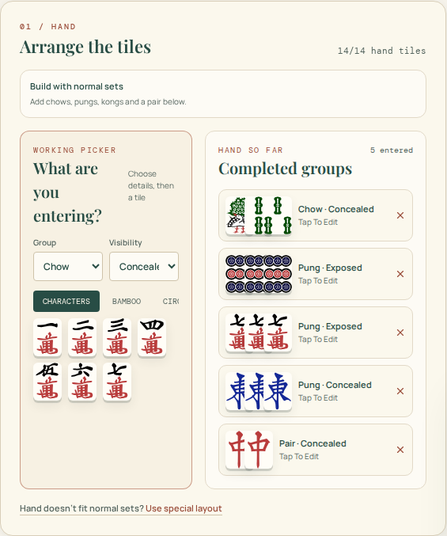

# British Mahjong Scorer

A free, browser-based **British Mahjong scoring calculator** for scoring complete four-player games and individual hands, learning the rules, and understanding **why** a score applies.

**Live:** https://mahjong.smooks.co.uk

British Mahjong Scorer is designed for use at the table. Players can enter scores directly or build hands visually with real Mahjong tile artwork. Where the entered tiles and game context provide enough evidence, the scorer calculates supported points, doubles, special hands and fishing automatically, then explains the result in plain English.

The product is deliberately **beginner-first, evidence-first, browser-first and local-first**.

> **Explain the game. Do not make the player learn the scoring engine.**

> **Never invent missing evidence. Calculate what can be supported, ask only when necessary, and treat unknown facts conservatively.**



## What is shipped

### Score a complete four-player game

The full game scorer manages the table hand by hand rather than acting as a simple total calculator.

- four-player British Mahjong game setup
- player Winds, East and prevailing-Wind progression
- winner and draw handling
- manual numeric scores and detailed calculated hand scores in the same game
- automatic settlement between players
- East doubling where applicable
- running balances
- canonical hand-by-hand ledger
- undo/correction support
- local recovery of an in-progress game after refresh or browser restart
- detailed historical hand evidence where it was actually recorded
- completed-game standings and final balances
- **Full game record** or **Game summary** through the browser Print / Save as PDF flow

The game ledger is the source of truth for both the live history and printable records. The project does not maintain a second report model that can drift away from the game itself.

### Score an individual hand

The same detailed scoring model can be used as a standalone calculator or opened for a player during a full game.

- visual tile entry using locally pinned Mahjong artwork
- Pungs, Kongs, Chows and pairs
- exposed and concealed state
- Remaining tiles for unfinished losing hands
- **partial-evidence scoring** without forcing a losing player to reconstruct every irrelevant tile
- complete-hand validation and whole-hand inference when enough evidence is present
- Flowers and Seasons, including own-Wind relationships
- irregular/special layouts when a hand does not fit ordinary sets
- winner/non-winner context before hand entry on mobile
- winning method and winning-tile provenance where a rule genuinely depends on them
- automatic supported points and doubles
- supported special-hand detection
- supported special-hand fishing detection
- event-sensitive special-hand questions only when required
- contextual explanations for patterns that actually apply
- conservative handling of `I'm not sure` / unknown evidence
- safe prefilled example hands opened from the learning/reference pages

A partial losing hand can still receive the score that is directly supported by the entered sets and bonus tiles. Whole-hand properties, special hands and fishing are withheld until the evidence is complete enough to support them.

### Explain the score rather than only output a number

The scorer reuses structured scoring output to explain what it has recognised.

- point-rule breakdowns
- double-rule breakdowns
- detected-pattern callouts
- special-hand results
- fishing results and possible completing tiles where supported
- component-aware special/fishing calculations, keeping fixed values separate from bonus-tile doubles
- settlement explanations based on the actual stored transactions
- clear distinction between calculated evidence and manually entered scores

Unmatched special hands are not dumped into the working scorer. The full catalogue lives in the learning/reference section instead.

### Learn British Mahjong alongside the scorer

The live site includes a connected set of learner and reference pages:

| Route | Purpose |
| --- | --- |
| `/` | Action-led homepage and calculator entry point |
| `/game` | Four-player game scorer and canonical ledger |
| `/hand` | Standalone British Mahjong hand calculator |
| `/scoring-examples` | Tested worked hands with prefilled scorer links and build-it-yourself practice |
| `/gameplay-basics` | How British Mahjong is played |
| `/guide` | Beginner scoring guide |
| `/special-hands` | Visual catalogue of supported special hands |
| `/features` | What the current scorer can do |
| `/how-it-works` | Evidence → score → explanation → settlement → record |
| `/help` | Searchable practical help and how-tos |
| `/mahjong-rules-compared` | British vs Hong Kong vs Riichi vs MCR vs American rules comparison |
| `/about` | Project purpose, rules, trust, privacy and attribution |

Legacy learner aliases redirect to the canonical pages:

- `/beginner-guide` → `/guide`
- `/special-hand-catalogue` → `/special-hands`

### Worked examples and build-it-yourself practice

The worked-example system uses the real scoring engine rather than a separate teaching calculator.

The `/scoring-examples` hub currently contains six test-backed examples covering ordinary scoring, exposed/concealed sets, Winds and Dragons, bonus tiles, partial losing hands, fishing and special-hand component scoring.

Each suitable example can:

- open as a safe prefilled standalone scorer state;
- open as a **Build it yourself** practice state with the learner's tiles and bonus selections empty;
- preserve the material target context such as player Wind, prevailing Wind, winner/non-winner state, winning method and table limit;
- show grouped set kind/visibility where that affects reconstruction;
- reveal the worked answer without replacing the learner's entered state; and
- return to the exact worked example or special-hand reference that launched it.

Example/practice states are kept separate from the saved four-player game. If a recoverable game exists, learner/reference pages and example modes can surface **Return to game** without overwriting or mutating that saved game.

### Responsive visual help

Help is not only prose. The repository contains a repeatable **responsive instructional screenshot system** built from the real product UI.

Phase 1 currently covers eight tasks:

1. start a game
2. enter scores during a game
3. build an ordinary hand
4. score a partial losing hand
5. identify the tile that completed Mah Jong
6. understand the score and reasoning
7. read settlement and game history
8. print or save the game record

Each task has Mobile, Tablet and Desktop captures: **24 real product screenshots** in total.

The Help page automatically selects the appropriate viewport image and also lets the visitor switch between Mobile, Tablet and Desktop. The same screenshot system is reused in the **How it works** page through compact `See it in the scorer` disclosures.

Screenshots are generated from deterministic product states rather than being manually mocked or cropped. The capture command checks that required product images have loaded correctly before writing the files.

## Product and trust model

### Evidence over assumption

A rule is applied only when the entered tiles, game context or explicit user answer provide enough evidence.

When evidence is missing, the scorer should:

- calculate only what can be proved;
- ask a short question if the missing fact genuinely matters; or
- omit the uncertain pattern/bonus.

It should not manufacture the most favourable interpretation.

### Partial, complete and invalid evidence are different states

For losing hands, entering fewer than the full structural tile count is not automatically an error.

- **Partial evidence** can score directly evidenced sets, pairs and bonus tiles.
- **Complete evidence** can additionally unlock whole-hand and fishing inference.
- **Invalid evidence** remains blocked where the entered hand is structurally impossible or contradictory.

### Manual scores remain manual

A numeric score entered by a player is valid game input, but the application never pretends that it verified a hand that was not entered.

Printed/history records therefore distinguish between:

- calculated detailed hands;
- partial detailed evidence; and
- manually entered scores with no fabricated tile detail.

### Canonical data is reused

The same underlying game/scoring information drives:

- live scoring
- settlement
- running balances
- game history
- explanations
- recovery
- printable Full/Summary records
- worked scoring examples and expected-result tests
- safe prefilled/practice scorer states

This is intentional: there should be one scoring/game truth, not several parallel interpretations of it.

## Rules and accuracy

The project implements the British Mahjong rules used by this scorer, based primarily on the published material at:

**https://mahjongbritishrules.wordpress.com/**

The engineering rules source of truth is [`BMJA_RULES_REFERENCE.md`](BMJA_RULES_REFERENCE.md). It records implemented rules, project interpretations, ambiguities, source links and test/fixture coverage.

Scoring implementation and audit notes are also maintained in [`artifacts/mahjong-scorer/SCORING_AUDIT.md`](artifacts/mahjong-scorer/SCORING_AUDIT.md).

This project is **independent and is not an official British Mah-Jong Association publication**. Public-facing explanations are project-owned paraphrases rather than reproductions of source material.

The rules engine is intentionally British-Mahjong-specific. Other rulesets are described for comparison at `/mahjong-rules-compared`, but are not silently treated as equivalent scoring systems.

## Architecture

The user-facing application is built with:

- React
- TypeScript
- Vite
- Tailwind CSS
- Vitest
- pnpm workspaces
- browser `localStorage` for local in-progress game recovery

Production is a static web application deployed on **Cloudflare Pages**.

There is currently:

- no user account requirement
- no cloud game database
- no server-side scoring engine
- no cross-device game sync

The current game is kept locally in the browser. This keeps table use low-friction and means the core scoring flow does not depend on an account or conventional application backend.

## Search, metadata and public routing

Public-route SEO configuration is centralised in:

[`artifacts/mahjong-scorer/src/site-seo.json`](artifacts/mahjong-scorer/src/site-seo.json)

That shared configuration supplies the canonical site URL, social image, route paths, titles, descriptions, indexability, aliases and homepage `WebApplication` structured data.

The production build reuses it to generate:

- route-specific crawler-visible HTML metadata
- canonical URLs
- Open Graph and Twitter metadata
- structured data
- `sitemap.xml`
- `robots.txt`
- Cloudflare Pages alias redirects

This avoids maintaining separate hard-coded route lists in the runtime app, prerender step and sitemap.

Shareable query-string example/practice states remain application states rather than separate indexable documents. Canonical public content lives on routes such as `/hand`, `/special-hands` and `/scoring-examples`.

## Run locally

This is a pnpm workspace. From the repository root:

```sh
pnpm install
PORT=5173 BASE_PATH=/ pnpm --filter @workspace/mahjong-scorer dev
```

Then open the local Vite URL shown in the terminal.

## Test and verify

Core scorer checks:

```sh
pnpm --filter @workspace/mahjong-scorer test
pnpm run typecheck
PORT=5173 BASE_PATH=/ pnpm --filter @workspace/mahjong-scorer build
```

The production build output is written to:

```text
artifacts/mahjong-scorer/dist/public
```

Recent merged product work has been validated against the full Vitest suite, typechecking and production build. The latest merged worked-example/practice implementation reported **206 passing tests**, with typecheck, production build and Cloudflare Pages deployment checks passing.

### Regenerate the instructional screenshot library

```sh
pnpm --filter @workspace/mahjong-scorer screenshots:help
```

The command initialises the pinned tile-artwork git submodule, starts the real app in deterministic demo states, captures the Mobile/Tablet/Desktop library and fails if required product images are unresolved.

Do not manually edit or crop the committed Help screenshots. See [`artifacts/mahjong-scorer/public/help/screenshots/README.md`](artifacts/mahjong-scorer/public/help/screenshots/README.md).

## Repository guides

The repository contains more than implementation code. Important project documents include:

- [`docs/PRODUCT_HANDBOOK.md`](docs/PRODUCT_HANDBOOK.md) — detailed product behaviour and trust model baseline
- [`docs/PRODUCT_CONTENT_PLAN.md`](docs/PRODUCT_CONTENT_PLAN.md) — content/product architecture and publishing direction
- [`docs/FEATURES_CONTENT.md`](docs/FEATURES_CONTENT.md) — canonical source copy for shipped feature descriptions
- [`docs/HOW_IT_WORKS_CONTENT.md`](docs/HOW_IT_WORKS_CONTENT.md) — evidence-first product explanation
- [`docs/HELP_CONTENT.md`](docs/HELP_CONTENT.md) — practical help and edge-case source content
- [`docs/INSTRUCTIONAL_SCREENSHOT_PLAN.md`](docs/INSTRUCTIONAL_SCREENSHOT_PLAN.md) — responsive visual-manual design and capture rules
- [`docs/MAHJONG_RULES_COMPARED_CONTENT.md`](docs/MAHJONG_RULES_COMPARED_CONTENT.md) — sourced comparison of major Mahjong ruleset families
- [`docs/MARKETING_COPY_BANK.md`](docs/MARKETING_COPY_BANK.md) — reusable product wording anchored to shipped behaviour
- [`docs/BEGINNER_GUIDE_CONTENT.md`](docs/BEGINNER_GUIDE_CONTENT.md) — learner scoring guide source
- [`docs/SPECIAL_HAND_CATALOGUE_CONTENT.md`](docs/SPECIAL_HAND_CATALOGUE_CONTENT.md) — supported special-hand catalogue source
- [`docs/GAMEPLAY_BASICS_CONTENT.md`](docs/GAMEPLAY_BASICS_CONTENT.md) — gameplay-basics source
- [`docs/ABOUT_THIS_PROJECT_CONTENT.md`](docs/ABOUT_THIS_PROJECT_CONTENT.md) — project/about source
- [`docs/video-series/README.md`](docs/video-series/README.md) — canonical five-video teaching-series plan and shared example hand
- [`docs/MOBILE_HAND_SCORER_UX_V2.md`](docs/MOBILE_HAND_SCORER_UX_V2.md) — mobile hand-entry UX direction
- [`docs/TILE_ASSET_DECISION.md`](docs/TILE_ASSET_DECISION.md) — tile artwork source and attribution decision
- [`BMJA_RULES_REFERENCE.md`](BMJA_RULES_REFERENCE.md) — engineering rules source of truth

## Current roadmap

The core scorer, full-game flow, learner pages, Help system, local recovery, printable canonical game records, responsive visual manual, public discovery/SEO foundation, reciprocal scorer/learning navigation, safe special-hand examples and tested worked-example/practice flow are already shipped.

The most relevant open directions now are:

- separate global product branding from the active British/BMJA-style rules profile before wider expansion — [#76](https://github.com/241443Mooks/BMJA-Mahjong-Scorer/issues/76)
- finish the bounded Western/Australian Mahjong discoverability research and decide the public `/western-mahjong` implementation — [#72](https://github.com/241443Mooks/BMJA-Mahjong-Scorer/issues/72), with draft research PR [#73](https://github.com/241443Mooks/BMJA-Mahjong-Scorer/pull/73)
- record and publish the five-part worked-hand/settlement teaching series — [#66–#70](https://github.com/241443Mooks/BMJA-Mahjong-Scorer/issues/66)
- make the scorer installable/offline as a Progressive Web App — [#48](https://github.com/241443Mooks/BMJA-Mahjong-Scorer/issues/48)

Other discovery and product experiments remain tracked in GitHub issues rather than being duplicated exhaustively here. The issue tracker contains the current acceptance criteria and implementation boundaries.

## Artwork

Mahjong tile artwork is sourced from `xhokir/riichi-mahjong-tiles`, based on `FluffyStuff/riichi-mahjong-tiles`, and used under **CC BY 4.0**.

The project pins the artwork locally rather than hot-linking it at runtime.

See [`THIRD_PARTY_NOTICES.md`](THIRD_PARTY_NOTICES.md) and [`docs/TILE_ASSET_DECISION.md`](docs/TILE_ASSET_DECISION.md) for attribution and licence details.

## Licence

Project source code authored for British Mahjong Scorer is licensed under the **MIT License**. See [`LICENSE`](LICENSE).

Original learner guides, explanatory copy, project documentation and other written content are not covered by the MIT License unless explicitly stated otherwise. Copyright (c) 2026 SMooks. All rights reserved unless otherwise stated.

Third-party materials keep their own licences and attribution requirements. See [`THIRD_PARTY_NOTICES.md`](THIRD_PARTY_NOTICES.md).

## Support the project

If British Mahjong Scorer is useful to you, you can support its continued development at:

**https://buymeacoffee.com/sharronmo**
