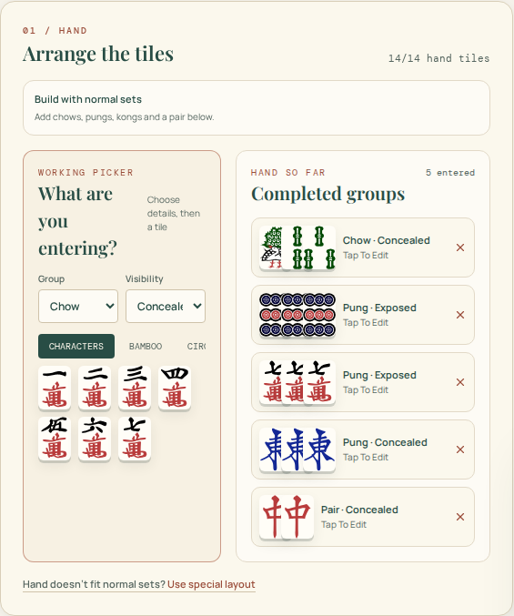

# Mahjong Reference

> **Your Mahjong table companion.**

[mahjong.smooks.co.uk](https://mahjong.smooks.co.uk) is a free, browser-based companion for scoring Mahjong hands, tracking a whole game, explaining settlement and keeping the table's chosen rules attached to the record.

No account is required. Current play is local-first and deterministic: the physical table supplies the facts, Mahjong Reference calculates from them, and missing evidence is not guessed.



## The problem

Mahjong is a social, physical game, but scoring can pull attention away from the table. Players may need to total a hand, remember which rules their group uses, work out who pays whom, update East and the prevailing Wind, and keep enough history to correct a mistake later.

There is also no single universal Mahjong ruleset. A calculator that quietly assumes one scoring tradition can be confidently wrong.

Mahjong Reference is built around a narrower job:

> **Remove arithmetic, ambiguity and bookkeeping without trying to play Mahjong for the players.**

## What the product does

The same rules-aware domain supports two main workflows:

- **Score a hand** — visual set/tile entry, partial losing hands, winning context, special hands and an auditable explanation.
- **Track a game** — four-player table state, manual or calculated hand scores, **Who pays whom** settlement, balances, East/Wind progression, recovery, correction, history and printable records.

Current public profiles are:

| Profile | Status |
| --- | --- |
| British / BMJA-style | Stable |
| Western — Thompson & Maloney | Provisional ordinary rules; source-certified Companion special-hand catalogue |
| Club rules | Configured profile |
| Buzzard 2000 | Executable and publicly selectable Classical profile |
| MCR / WMO 2006 | `0.1` Provisional hand scorer and Table Companion; `1.0` awaits experienced-player review |

The project is independent and does not claim BMJA endorsement or affiliation with any Mahjong association or society.

## Product and engineering decisions

A few decisions shape the whole project:

- **Deterministic rules engines are the authority.** AI may later help translate speech into structured evidence or explain verified facts; it does not invent or calculate the Mahjong rules.
- **Explain rather than guess.** Unknown material evidence remains unknown and fails conservatively.
- **Evidence first; structure where known.** Players can state groups they recognise and provide unresolved tiles separately; explicit player evidence outranks later interpretation.
- **Ask only when it matters.** Classical winning/event/context questions are driven by exact-runtime materiality rather than universal form requirements.
- **Hand value and settlement are separate.** What a hand scores is not automatically what a player pays or receives.
- **Rules identity is data, not a label.** Saved games retain an exact profile/version so later changes cannot silently reinterpret old play.
- **Free table play stays local-first.** Future accounts, billing, cloud sync or AI services must not become a dependency for ordinary play.
- **The app observes the resolved physical game.** It does not need to simulate walls, turns or claims merely to score and advance the table.

## Rules platform

The project started as a British Mahjong scorer. Adding Western and Club profiles exposed a larger design problem: related Mahjong traditions can share tile structures and pattern recognition while differing in values, settlement, progression and even the scoring grammar itself.

The platform therefore uses one profile envelope above a small number of scoring grammars:

1. **Classical points + doubles** — British/Western/Classical profiles;
2. **Pattern accumulator** — MCR and related traditions;
3. **Riichi han + fu** — Riichi-family architecture; EMA Riichi runtime is not implemented yet;
4. **Target catalogue / external target evidence** — architecture for American/NMJL-style target-value families, with any proprietary annual card remaining outside the product.

The shared rules platform, permanent parity/replay harness and caller cutover are **live on production `main`**. Buzzard 2000 and MCR/WMO 2006 are also live. The complete EMA Riichi 2025 source/correctness corpus is ready; the pre-Riichi architecture gate has now passed, but Riichi runtime is still not implemented and begins with a fresh preflight against current `main`.

The durable rules rollout tracker is [#275](https://github.com/241443Mooks/BMJA-Mahjong-Scorer/issues/275). The live programme map is [#105](https://github.com/241443Mooks/BMJA-Mahjong-Scorer/issues/105).

## Hybrid hand entry — completed

The bounded [#386](https://github.com/241443Mooks/BMJA-Mahjong-Scorer/issues/386) programme is complete and closed.

The Classical scorer now follows the product rule:

> **Enter what you know, add the rest, interpret only what can be proved, and ask only for material facts the evidence cannot supply.**

The delivered path includes:

- explicit groups plus unresolved physical tiles as peer evidence;
- all-loose ordinary Classical entry without diagnosing a hand type first;
- explicit-only entry remaining authoritative;
- exact-profile decomposition only over unresolved evidence;
- complete-winner, partial, 13-tile and fishing paths;
- conservative deterministic non-winner inference;
- explicit handling of ambiguous lawful decompositions;
- inferred-Kong confirmation when declaration/exposure can materially alter the result;
- winning-tile and other Classical evidence questions only when exact-runtime alternatives differ;
- persistence/reopen with inferred-versus-entered provenance retained;
- representative all-explicit, mixed and all-loose coverage across BMJA, Club, Buzzard and Western.

The standalone hand calculator was then simplified through real-phone QA in [#411](https://github.com/241443Mooks/BMJA-Mahjong-Scorer/issues/411), and the shared shell gained a state-safe canonical Share action in [#400](https://github.com/241443Mooks/BMJA-Mahjong-Scorer/issues/400).

## Machine-readable rules truth — architecture complete, corpus expansion next

The [#399](https://github.com/241443Mooks/BMJA-Mahjong-Scorer/issues/399) architecture programme is complete and closed.

It made the existing source, evidence, semantic identity, profile treatment, executable runtime and downstream reference chain explicitly machine-readable and auditable:

```text
real source
→ source record
→ evidence claim
→ canonical semantic identity
→ exact profile treatment
→ executable profile/runtime
→ input evidence
→ decision trace/result
→ reference / comparator / Table Companion / AI projections
```

The model has been proved vertically on Classical and MCR, with fail-closed integrity checks and a passing pre-Riichi readiness audit. This remains deliberately **not** a generic rules language and not a second score database.

The next bounded rules-truth work is [#440](https://github.com/241443Mooks/BMJA-Mahjong-Scorer/issues/440): expand the reviewed corpus through the existing typed/sharded authority model without redesigning it or copying executable score truth.

Closely related projections consume the same truth rather than forking it:

- [#296](https://github.com/241443Mooks/BMJA-Mahjong-Scorer/issues/296) — shared rules comparator/dimension model;
- [#405](https://github.com/241443Mooks/BMJA-Mahjong-Scorer/issues/405) — single-profile human-readable ruleset report over that shared dimension model; the shared #406 substrate is complete;
- [#251](https://github.com/241443Mooks/BMJA-Mahjong-Scorer/issues/251) — structured reference / Encyclopaedia projections;
- [#412](https://github.com/241443Mooks/BMJA-Mahjong-Scorer/issues/412) — curated public What's New history above the technical changelog.

A [#434](https://github.com/241443Mooks/BMJA-Mahjong-Scorer/issues/434) umbrella captures American/NMJL-style support. Its first stage is evidence/architecture preflight only. The guiding boundary is **use the annual card; do not become the annual card**: Mahjong Reference may work alongside the player's card, but must not reproduce, transcribe or encode the proprietary annual hand catalogue.

[#447](https://github.com/241443Mooks/BMJA-Mahjong-Scorer/issues/447) records a future ruleset compiler/authoring pipeline for turning source documents into structured, auditable candidate profiles. It is intentionally parked until real corpus-migration and family-onboarding evidence justifies the next level of automation.

For current sequencing, use [#105](https://github.com/241443Mooks/BMJA-Mahjong-Scorer/issues/105) and `docs/product/WHATS_NEXT_ROADMAP.md`.

## Structured Mahjong knowledge

The longer-term reference direction is not a wiki or a second prose rules database. [#251](https://github.com/241443Mooks/BMJA-Mahjong-Scorer/issues/251) builds toward a **machine-readable, source/runtime-backed Mahjong knowledge layer** whose human-readable reference pages are views over the same verified concepts, profile treatments, relationships and evidence.

The source-local inventory contains **626 entries across 18 corpora** before cross-family de-duplication or canonical concept matching.

The public **Special Hands Guide** already proves the approach on the current executable Classical family: it is concept-first and learner-facing while retaining all **146 exact profile-local treatment identities** underneath. Search, rules selection, examples and scorer handoff derive from those exact treatments rather than a second hand-maintained score catalogue. Scorer results now deep-link to the exact owning treatment, and the Guide can compare 2–3 exact treatments locally without changing the player's remembered rules choice.

The same structured layer is intended to support future comparison tools, broader reference pages and grounded AI/voice explanations. See `docs/product/REFERENCE_KNOWLEDGE_ARCHITECTURE.md`.

## Trust and provenance

`/under-the-hood` explains the public reasoning chain in product language:

```text
source evidence
→ exact rules profile/version
→ evidence from the table
→ score
→ settlement
→ progression
→ durable record
```

Source/provenance work remains deliberately separate from retail or marketing metadata. Unknown or provisional rules evidence stays visibly unknown or provisional.

## Other product work

- **Mahjong Reference Plus** is designed as optional convenience: cloud memory, preferences and later metered services; free scoring/table play remains account-free. See `docs/product/MAHJONG_REFERENCE_PLUS_ARCHITECTURE.md` and #206.
- **Voice hand entry** is an evaluation-first experiment: speech → structured evidence → deterministic scorer → Accept/Edit. See #147.
- **Analytics** is deliberately limited and cookieless. See `docs/product/ANALYTICS_MEASUREMENT_PLAN.md` and #246.
- **Search/content growth** is evidence-led. The current strategy is `docs/product/SEO_GROWTH_STRATEGY.md`; reference expansion is sequenced around verified rules identities rather than speculative page generation.
- **Contact and feedback** remain a low-friction public-product stream under #393.
- **Production confidence** continues through #253, #89 real-table validation on 10 October 2026, analytics observation and experienced-player MCR review.

## Repository map

- `artifacts/mahjong-scorer/` — production React application and tests
- `docs/product/` — current product/platform decisions, measurement records and the dated handoff roadmap
- `docs/rules/` — rules evidence, provenance, source crosswalks and rules-platform contracts
- `docs/research/` — product discovery evidence and synthesis
- `docs/content/` — shipped/public-copy source records; not current product authority
- `docs/video-series/` — video production scripts and plans
- `docs/archive/` — superseded planning retained for archaeology only
- `docs/README.md` — documentation authority map
- `CHANGELOG.md` — durable product milestones
- `Agents.md` — bounded implementation guardrails

`main` is the production line. Current work should branch from current `main`, remain bounded to its issue contract, and return through a reviewed PR. The old rules-platform integration train is historical and must not be restarted.

## Stack

React · TypeScript · Vite · Tailwind CSS · Vitest · pnpm · Cloudflare Pages

Product analytics uses a deliberately constrained PostHog Cloud EU integration; details and the known cookieless traffic-classification caveat live in `docs/product/ANALYTICS_MEASUREMENT_PLAN.md`.

## Run and verify

```sh
pnpm install --frozen-lockfile
PORT=5173 BASE_PATH=/ pnpm --filter @workspace/mahjong-scorer dev
```

Before a production PR is ready:

```sh
pnpm test
pnpm run typecheck
PORT=5173 BASE_PATH=/ pnpm run build
git diff --check
```

## Licence and attribution

Project software authored for Mahjong Reference is MIT-licensed. Original written/educational content is not covered by the MIT licence unless explicitly stated otherwise.

Mahjong tile artwork comes from `xhokir/riichi-mahjong-tiles`, based on `FluffyStuff/riichi-mahjong-tiles`, under CC BY 4.0. See `THIRD_PARTY_NOTICES.md` and `docs/product/TILE_ASSET_DECISION.md`.

Copyright (c) 2026 SMooks.
